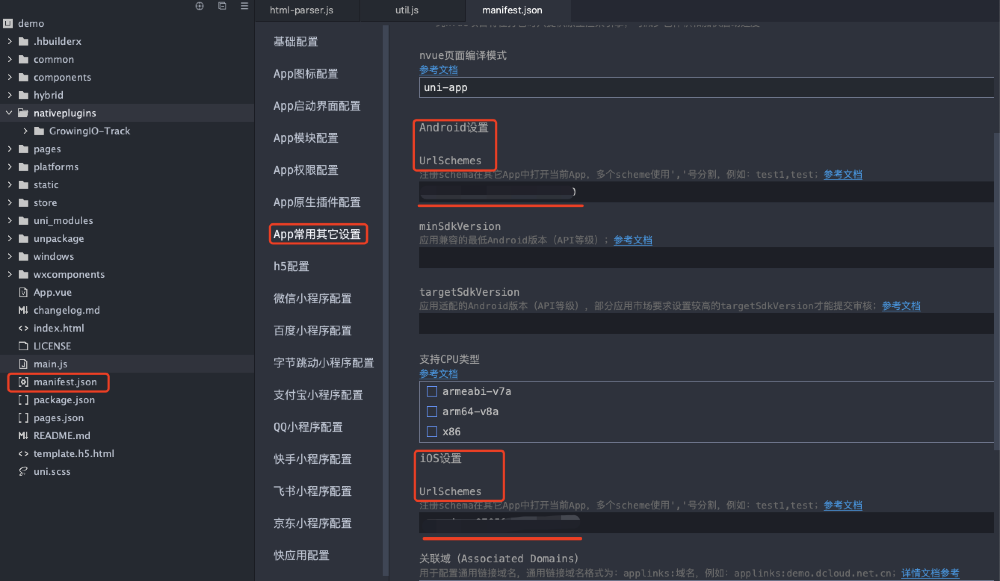

# uniapp 埋点SDK



GitHub Demo： [https://github.com/growingio/growing-sdk-uniapp](https://github.com/growingio/growing-sdk-uniapp)

uniapp 全版本支持

App适配最低系统版本：iOS 8及以上、Android 4.2-10


## 1. 集成

1. 下载该仓库代码，将release 文件夹下 GrowingIO-Track 添加至工程的 nativeplugins 目录下

&#x20; 2\. HBuilderX中，在对应工程的 manifest.json 中选择“App原生插件配置”，本地插件\[选择本地插件]，勾选 GrowingIO-Track 插件，并将必填字段进行填写

* growing\_android\_account\_id 即项目id, 可在官网查看
* growing\_ios\_account\_id 即项目id, 可在官网查看
* growing\_android\_url\_scheme 即android项目的 urlscheme
* 其余字段均为可选字段, 除debug字段外(默认为非debug模式), 服务器地址配置默认都是当前SaaS地址(无需额外配置)


3\. HBuilderX中配置唤醒 urlscheme

* manifest.json中选择“App常用其它设置”
  * Android设置中UrlSchemes配置官网提供的android项目urlscheme
  * iOS设置中UrlSchemes配置官网提供的ios项目urlscheme



4\. uniapp 工程中的代码书写示例

```
gio = uni.requireNativePlugin('GrowingIO-Track')
gio.track({'eventId':'activate'});

//自定义参数
gio.track({
   "eventId": "custom",
   "eventLevelVariable": {
      "grow_index": "苹果",
      "grow_click": 14
   }
});
```

插件位于 release 文件夹下。\
该插件用于 HBuilder 云打包使用，而且仅在云打包情况下，manifest.json 下的参数设置才能在app中生效。

若是自己使用工具（Android Studio 或者 Xcode）打包可以参考 [UniPlugin-Android](https://github.com/growingio/growing-sdk-uniapp/tree/main/UniPlugin-Android) 和 [UniPlugin-iOS](https://github.com/growingio/growing-sdk-uniapp/tree/main/UniPlugin-iOS) 两个例子进行集成。

### 关于插件说明

该插件用于 HBuilder 云打包使用，而且仅在云打包情况下，manifest.json 下的参数设置才能在app中生效。

若是自己使用工具（Android Studio 或者 Xcode）打包可以参考如下：



[官方参考文档](https://nativesupport.dcloud.net.cn/NativePlugin/course/android)

两种方式：一种为依赖 Android Module 模式，可参考示例代码 app 中查看，另一种引入 aar 包，可参考示例代码 app2 中查看。

### 方式一：依赖 Android Module

1. 在您的Android Studio 项目中导入 uniplugin\_growingio 模块；
2. 在示例app 模块的 build.gradle 中添加模块

```
// 添加uni-app插件
implementation project(':uniplugin_growingio')
```

&#x20;3\. 在 `uniplugin_growingio` 模块的 `GrowingIOTrackAppProxy` 类里面进行 growingIo sdk 的初始化，具体可以参考[GrowingIO sdk 文档](https://docs.growingio.com/docs/developer-manual/sdkintegrated/android-sdk/manunl-android-sdk)

&#x20;4\. 在示例 app 模块下的 assets 的 dcloud\_uniplugins.json 中添加插件

```
{
  "nativePlugins": [
    {
      "hooksClass": "com.growingio.android.uniplugin.GrowingIOTrackAppProxy",
      "plugins": [
        {
          "type": "module",
          "name": "GrowingIO-Track",
          "class": "com.growingio.android.uniplugin.GrowingIOTrackModule"
        }
      ]
    }
  ]
}
```

&#x20;5\. 最后在您的vue文件中调用

```
const growing = uni.requireNativePlugin('GrowingIO-Track');
growing.track({'eventId':'login'});
growing.printLog('这是 GrowingIO 模块的消息');
```

&#x20;6\. 最后根据官方调用原生插件的过程，将通过 HBuilderX 发行的 www 文件夹覆盖到示例 app 模块下的 www 后就可以运行查看结果。 [官方插件调试教程](https://nativesupport.dcloud.net.cn/NativePlugin/course/android?id=%e6%8f%92%e4%bb%b6%e8%b0%83%e8%af%95)

### 方式二：引入 aar 包

具体可以参考示例 app2 下的配置

1. 在 您的项目的 libs 下放入 `growingio-uniplugin.aar` 包
2. 在 `build.gradle` 添加依赖

```
//最新版本的growingio 埋点sdk 版本
implementation "com.growingio.android:vds-android-agent:track-2.8.25"
```

&#x20;3\. 在 `AndroidManifest.xml` 中配置项目

```
    <!--    growingIO 配置设置开始    -->
    <meta-data
        android:name="growing_android_account_id"
        android:value="9a7f70313f66fb62" />

    <meta-data
        android:name="growing_android_url_scheme"
        android:value="growing.4cf6e0a04c6a7b10" />

    <meta-data
        android:name="growing_android_debug"
        android:value="true" />

    <!--    growingIO 配置设置结束    -->
```

更多配置对应表

| 参数                            | sdk 方法         |
| ----------------------------- | -------------- |
| growing\_android\_account\_id | setDeviceId    |
| growing\_android\_url\_scheme | setURLScheme   |
| growing\_android\_debug       | setDebugMode   |
| growing\_channel              | setChannel     |
| growing\_zone                 | setZone        |
| growing\_gta\_host            | setGtaHost     |
| growing\_data\_host           | setDataHost    |
| growing\_report\_host         | setReportHost  |
| growing\_ws\_host             | setWsHost      |
| growing\_tracker\_host        | setTrackerHost |
| growing\_tracker\_rnmode      | setRnMode      |

&#x20;4\. 在 assets 的 dcloud\_uniplugins.json 中添加插件

```
{
  "nativePlugins": [
    {
      "hooksClass": "com.growingio.android.uniplugin.GrowingIOTrackConfigAppProxy",
      "plugins": [
        {
          "type": "module",
          "name": "GrowingIO-Track",
          "class": "com.growingio.android.uniplugin.GrowingIOTrackModule"
        }
      ]
    }
  ]
}
```

5\. 最后可以通过运行 app2 例子来查看结果。



可以直接通过依赖插件来集成。

### 依赖 Library

请结合 [官方参考文档](https://nativesupport.dcloud.net.cn/NativePlugin/course/ios) 来集成

1. 在 xcode 项目中导入 GrowingIOUniPlugin 库；
2. 按照参考文档，将项目与 GrowingIOUniPlugin 库建立连接；
3. 在 GrowingIOUniPlugin 中引入 GrowingIO ，集成可以查看 [GrowingIO iOS  集成](https://docs.growingio.com/v3/developer-manual/sdkintegrated/ios-sdk/auto-ios-sdk)。具体的代码配置在 `GrowingIOTrackProxy` 中。
4. 若是无法找到 `Growing.h` 文件，则需要在 Target `GrowingIOUniPlugin` => `Build Settings` => `Header Search Paths` 添加 `"$(SRCROOT)/Pods/Growing/PublicHeader"`路径并设为 recursive。
5. 在 HBuilder-Hello 项目中的 `HBuilder-uniPlugin-Info.plist` 中配置插件

```
<key>dcloud_uniplugins</key>
  <array>
    <dict>
      <key>hooksClass</key>
      <string>GrowingIOTrackProxy</string>
      <key>plugins</key>
      <array>
        <dict>
          <key>class</key>
          <string>GrowingIOTrackModule</string>
          <key>name</key>
          <string>GrowingIO-Track</string>
          <key>type</key>
          <string>module</string>
        </dict>
      </array>
    </dict>
  </array>
```

1. 最后可以通过运行 HBuilder 例子来查看结果。
2. 若是运行出现无法找到 Growing 相关类的情况，则需要到 HBuilfer-uniPlugin `Target` => `Build Phases` => `Link Binary With Libraries` 添加 `GrowingCoreKit.framework`。

### 更多说明

本例子只有 `GrowingIOUniplugin` 库 和 `HBuilder-Hello` 项目。主要的项目结构请以[官方参考文档](https://nativesupport.dcloud.net.cn/NativePlugin/course/ios)给出的例子为主，官方例子解压后将 `GrowingIOUniplugin` 库导入和`HBuilder-Hello` 项目替换掉即可。



## 2. 自定义数据上传

### 采集自定义事件

```javascript
track({eventId, eventLevelVariable})
```

采集自定义事件 `eventId`，该事件的属性信息属于事件级变量。

在添加所需要发送的事件代码之前，需要在打点管理用户界面配置事件以及事件级变量`eventLevelVariable`。

**参数说明：**

| 参数名称                 | 参数类型   | 必填 | 说明            |
| -------------------- | ------ | -- | ------------- |
| `eventId`            | String | 是  | 事件标识符         |
| `eventLevelVariable` | Object | 否  | 事件发生时所伴随的维度信息 |

**参数限制条件：**

参数违反以下条件将不发送数据，调用后请验证数据是否发送，事件类型`t`为`cstm`。

| 参数名称                 | 限制条件                                                                                                                                                                                                                                      |
| -------------------- | ----------------------------------------------------------------------------------------------------------------------------------------------------------------------------------------------------------------------------------------- |
| `eventId`            | 非空，长度限制小于等于50；                                                                                                                                                                                                                            |
| `eventLevelVariable` | <p>非空，长度限制小于等于100（<code>eventLevelVariable.length()&#x3C;=100</code>）；</p><p><code>eventLevelVariable</code> 内部不允许嵌套 Object；</p><p><code>eventLevelVariable</code>Object 中的 <code>key</code>长度限制小于等于50，<code>value</code>长度限制小等于1000。</p> |

```javascript
// track API调用示例一
growing.track({'eventId': 'loanAmount'})；
// track API调用示例二
growing.track({
               "eventId": "loanAmount",
	       "eventLevelVariable": {
				      "gender": "male",
				      "age": 21
				      }
              });
```

**检验数据发送日志示例：**

注意 `t` 等于 `cstm` 字段，表示自定义事件发送成功，只需注意 `var`、`n` 、`num`字段，其它字段无需仔细验证**。**

```javascript
//展示 track 接口调用示例三日志内容
{
    "s":"31e3aa14-5241-490c-821c-a741e9bf0f87",
    // t 为事件类型， track 接口调用发送的事件类型为 cstm
    "t":"cstm",
    "tm":1532085495251,
    "d":"com.growingio.android.test",
    // n 为 eventId 参数携带的值
    "n":"loanAmount",
    // var 为 eventLevelVariable 参数携带的值
    "var":{
        "gender":"male",
        "age":"21"
    },
    "ptm":0,
    "gesid":18,
    "esid":0,
    "u":"b6247b01-a31a-3bc6-a391-4c456888c1ee"
}
```


#### 推荐您使用MobileDebugger，我们为您列举了应用场景和验证示例，请移步查看：[cstm 事件验证](../../debugging/verification/cstm.md)。


### 设置转化变量

```javascript
setEvar(conversionVariables)
```

发送一个转化信息用于高级归因分析，在添加代码之前必须在打点管理界面上声明转化变量。

转化变量是一种非常强大的变量类型，主要是为了归因而用，比如访问渠道、站外搜索关键词、站内搜索关键词等等。在 GrowingIO 里面可以定制变量的归因方式和持久性范围。

**参数说明：**

| 参数名                 | 类型     | 是否必填 | 描述    |
| ------------------- | ------ | ---- | ----- |
| conversionVariables | Object | 是    | 转化级属性 |

**参数限制条件：**

| 参数名称                | 限制条件                                                                                                                                                                                                    |
| ------------------- | ------------------------------------------------------------------------------------------------------------------------------------------------------------------------------------------------------- |
| conversionVariables | <p>非空，键值对个数小于等于100；</p><p><code>conversionVariables</code> 内部不允许含有<code>Object</code> 嵌套；</p><p><code>conversionVariables</code>Object 中的 <code>key</code>长度限制小于等于50，<code>value</code>长度限制小等于1000。</p> |

```java
growing.setEvar({ "evarTest":111,"campaignId":"1234567890","campaignOwner":"Li Si" });
```

**检验数据发送日志示例：**

注意 `t` 等于`evar`字段，表示自定义事件发送成功，只需注意 `var` 字段，其它字段无需仔细验证**。**

```javascript
{
    "s":"e1c48845-dd60-4cf2-b1a5-a8e529d2188d",
    // t 为事件类型， evar 为转化事件
    "t":"evar",
    "tm":1532338526083,
    "d":"com.growingio.android.test",
    "cs1":"GrowingIO",
    // 转化变量
    "var":{
        "evarTest":111,
        "campaignId":"1234567890",
        "campaignOwner":"Li Si"
    },
    "gesid":300,
    "esid":22
}
```


#### 推荐您使用 MobileDebugger，我们为您列举了应用场景和验证示例，请移步查看：[ evar 事件验证](../../debugging/verification/evar.md)


### 设置登录用户变量

```javascript
setPeopleVariable(peopleVariables)
```

设置用户自身属性相关的属性信息，比如用户姓名、邮件地址、信用等级等。

在添加代码之前必须在打点管理界面上声明用户变量。

**参数说明：**

| 参数名             | 类型     | 是否必填 | 描述   |
| --------------- | ------ | ---- | ---- |
| peopleVariables | Object | 是    | 用户属性 |

**参数限制条件：**

| 参数名称            | 限制条件                                                                                                                                                                                                                                               |
| --------------- | -------------------------------------------------------------------------------------------------------------------------------------------------------------------------------------------------------------------------------------------------- |
| peopleVariables | <p>非空，长度限制小于等于100（<code>peopleVariables.length()&#x3C;=100</code>）；</p><p><code>peopleVariables</code> 内部不允许含有<code>JSONObject</code>或者；</p><p><code>peopleVariables</code>Object 中的 <code>key</code>长度限制小于等于50，<code>value</code>长度限制小等于1000。</p> |

```javascript
growing.setPeopleVariable({ 'name': 'textName', 'email': 'testName@company.com' })
```

**检验数据发送日志示例：**

注意 `t` 等于`ppl`字段，表示用户变量发送成功，只需注意 `var`字段，其它字段无需仔细验证。

```javascript
{
    "s":"a35872af-13df-4479-90bc-25558d12328e",
    // t 为事件类型， pvar 为发送用户变量事件
    "t":"ppl",
    "tm":1532339208991,
    "d":"com.growingio.android.test",
    "cs1":"GrowingIO",
    // 用户变量
    "var":{
        'name': 'textName', 
        'email': 'testName@company.com'
    },
    "gesid":311,
    "esid":0
}
```


#### 推荐您使用 MobileDebugger，我们为您列举了应用场景和验证示例，请移步查看：[ ppl 事件验证](../../debugging/verification/ppl.md)


### 设置登录用户ID

```javascript
setUserId(userId);
```

把 GrowingIO 识别的访问用户跟应用自身的注册用户做关联，用以登录用户行为分析。

**参数说明：**

| 参数名称   | 参数类型   | 必填 |                                                                                           | 说明 |
| ------ | ------ | -- | ----------------------------------------------------------------------------------------- | -- |
| userId | String | 是  | <p>登录用户Id，长度限制小于等于1000；</p><p>如果值为空则清空了登录用户变量，不建议这么用，</p><p>请使用 clearUserId 清除登录用户变量。</p> |    |

```java
growing.setUserId('xiaoming');
```

注：您的 App 每次用户升级版本时无需重新登录的话，建议在用户每次升级App 版本后初次访问时重新调用上述 setUserId 方法。

### 清除登录用户ID

```javascript
clearUserId();
```

当访问用户跟注册用户关联后，之后触发的行为会绑定到该注册用户上。如果有需要解除绑定，比如用户退出登录后，可以通过该函数解决绑定。

**示例**

```javascript
growing.clearUserId();
```

### 设置访问用户变量

当用户未登录时，定义用户属性变量，也可用于A/B测试上传标签。

```java
setVisitor(visitorVar)
```

**参数说明：**

| 参数名称         | 参数类型   | 必填 | 说明                                                                                                                                                             |
| ------------ | ------ | -- | -------------------------------------------------------------------------------------------------------------------------------------------------------------- |
| `visitorVar` | Object | 是  | <p>不可使用嵌套的<code>JSONObject</code>对象，即为JSONObject中不可以放入<code>JSONObject</code>或者<code>JSONArray</code>；</p><p>key 长度限制小于等于50，value长度限制小等于1000，值不能为空串，也就是""。</p> |

```java
uexGrowingIO.setVisitor({"gender":"male","age":21});
```

**检验数据发送日志示例：**

注意 `t` 等于`vstr`字段，表示访问用户变量发送成功，其它字段无需仔细验证。

```javascript
{
    "s":"d334b4a1-57eb-4bf4-b426-64c1cce5a5c0",
    // t 为事件类型， vstr 为发送访问用户变量事件
    "t":"vstr",
    "tm":1532341259134,
    "d":"com.growingio.android.test",
    "cs1":"GrowingIO",
    //访问用户变量
    "var":{
        "gender":"male",
        "age":21
    },
    "gesid":322,
    "esid":0
}
```

## 3. 创建应用


**添加代码之后，请先Clean项目，然后再进行编译，并在您的 App 安装了 SDK 后重新启动几次 App，保证行为采集数据自动发送给 GrowingIO，以便顺利完成检测。**

**如果您的 uniapp 应用会被分别打包成新的 Android 和 iOS APP，则需要分别创建Android 和 iOS应用。**


在GrowingIO平台的应用创建页面继续完成应用创建的数据检测，检测成功后应用创建成功。

## 4. 验证SDK是否正常采集数据 <a href="#5-yan-zheng-sdk-shi-fou-zheng-chang-cai-ji-shu-ju" id="5-yan-zheng-sdk-shi-fou-zheng-chang-cai-ji-shu-ju"></a>

了解GrowingIO平台数据采集类型请参考[数据模型](../../../introduction/datamodel/)。

GrowingIO为您提供多种验证SDK是否正常采集数据的方式：

方式一：[Mobile Debugger​​](../../debugging/mobile-debugger.md)

方式二：在SDK中设置了Debug模式后，在IDE编译器控制台查看数据采集日志。
