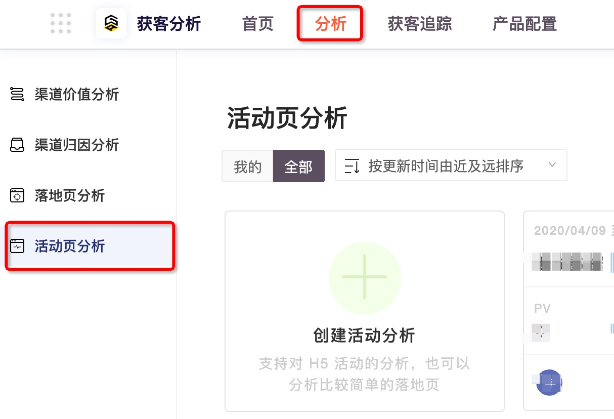
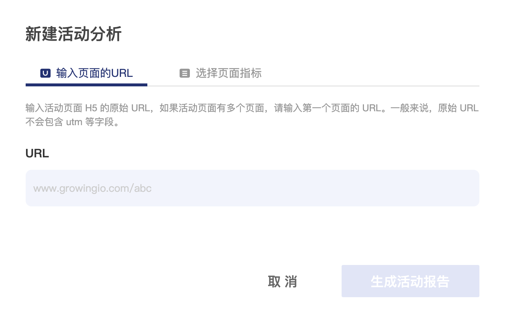
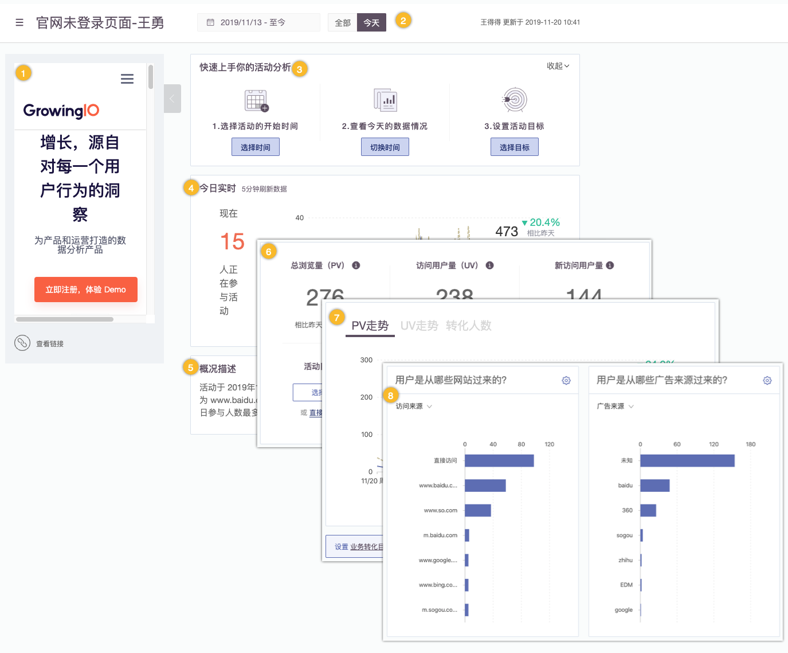

# 活动页分析

## **什么是活动页分析**

活动页分析是对您线上活动页面的用户访问情况的分析，只需要输入线上投放活动网页的 URL（Web）或页面圈选指标（App） ，就可以获得基本的活动数据，节约处理数据的时间，直接获得洞察 ，帮助你提高活动效果，高效汇报，开心工作。

## 创建活动页分析

一. 在顶部导航栏选择“**获客分析 &gt; 分析 &gt; 活动页分析”**，进入活动管理页面。

二. 单击**创建活动分析**，进入**新建活动也分析**页面。

| 参数 | 说明 |
| :--- | :--- |

<table>
  <thead>
    <tr>
      <th style="text-align:left">&#x8F93;&#x5165;&#x9875;&#x9762;&#x7684;URL</th>
      <th style="text-align:left">
        
&#x8F93;&#x5165;&#x6D3B;&#x52A8;&#x9875;&#x9762;&#x7684;URL&#x3002;

        
&#x6B64;&#x65B9;&#x6CD5;&#x9002;&#x7528;&#x4E8E;&#x53EA;&#x5728;Web&#x7AEF;&#x5C55;&#x793A;&#x7684;H5&#x9875;&#x9762;&#x3002;

      </th>
    </tr>
  </thead>
  <tbody></tbody>
</table>| 选择页面指标 | 选择页面浏览事件，作为活动页面。 |
| :--- | :--- |

四. 填写活动分析名称后单击**保存**，默认进入当前活动分析页面。

五. 选择活动开始的时间与分析页面数据展示的时间。

> * 新建的活动分析开始时间为7天前至今日。
> * 默认展示全部数据，您可以选择全部或今天。

六. 设置活动目标。

> * 您可以将某个事件的发生作为活动目标（比如注册事件、领取优惠券事件等），来作为转化量的衡量。
> * 活动目标可选择埋点事件、无埋点事件、合并事件、计算指标和直接输入URL。

## **各模块介绍**

| 模块 | 说明 |
| :--- | :--- |

| 1-活动页面展示 | 展示当前活动页。 |
| :--- | :--- |

| 2-时间选择 | 选择活动时间和分析页面展示的时间。 |
| :--- | :--- |

<table>
  <thead>
    <tr>
      <th style="text-align:left">3-&#x5FEB;&#x901F;&#x4E0A;&#x624B;&#x5F15;&#x5BFC;</th>
      <th style="text-align:left">
        
&#x521B;&#x5EFA;&#x5B8C;&#x5206;&#x6790;&#x9875;&#x9762;&#x540E;&#x7684;&#x5F15;&#x5BFC;&#x4E8B;&#x9879;&#x3002;

        
&#x64CD;&#x4F5C;&#x7B80;&#x5355;&#xFF0C;&#x8DDF;&#x7740;&#x4E00;&#x8D77;&#x505A;&#x4E00;&#x505A;&#xFF0C;&#x5FEB;&#x901F;&#x4E86;&#x89E3;&#x6D3B;&#x52A8;&#x9875;&#x57FA;&#x672C;&#x60C5;&#x51B5;&#x3002;

      </th>
    </tr>
  </thead>
  <tbody></tbody>
</table><table>
  <thead>
    <tr>
      <th style="text-align:left">4-&#x4ECA;&#x65E5;&#x5B9E;&#x65F6;</th>
      <th style="text-align:left">
        <ul>
          <li>&#x5C55;&#x793A;&#x5F53;&#x524D;&#x53C2;&#x4E0E;&#x6D3B;&#x52A8;&#x4EBA;&#x6570;&#xFF1B;</li>
          <li>&#x5C55;&#x793A;&#x4ECA;&#x65E5;&#x7684;&#x5B9E;&#x65F6;&#x6570;&#x636E;&#x60C5;&#x51B5;&#xFF0C;&#x4EE5;&#x53CA;&#x4ECA;&#x65E5;&#x5BF9;&#x6BD4;&#x6628;&#x65E5;&#x7684;&#x5B9E;&#x65F6;&#x8D8B;&#x52BF;&#xFF1B;</li>
        </ul>
        
&#x6574;5&#x5206;&#x949F;&#x5237;&#x65B0;&#x4E00;&#x6B21;&#x5B9E;&#x65F6;&#x6570;&#x636E;&#xFF0C;&#x6BD4;&#x5982;&#x73B0;&#x5728;&#x662F;15:48&#xFF0C;&#x90A3;&#x4E48;&#x5B9E;&#x65F6;&#x6570;&#x636E;&#x662F;15:40-15:45&#x7684;&#x3002;

      </th>
    </tr>
  </thead>
  <tbody></tbody>
</table>| 5-概况描述 | 描述活动开始至今的概况。 |
| :--- | :--- |

<table>
  <thead>
    <tr>
      <th style="text-align:left">6-&#x6570;&#x636E;&#x6982;&#x89C8;</th>
      <th style="text-align:left">
        
&#x67E5;&#x770B;&#x65F6;&#x95F4;&#x8303;&#x56F4;&#x5185;&#x7684;PV&#x3001;UV&#x3001;&#x65B0;&#x7528;&#x6237;&#x91CF;&#x3002;

        
&#x53EF;&#x4EE5;&#x5728;&#x6B64;&#x6A21;&#x5757;&#x8BBE;&#x7F6E;&#x8F6C;&#x5316;&#x76EE;&#x6807;&#xFF0C;&#x8BBE;&#x7F6E;&#x540E;&#x53EF;&#x4EE5;&#x5C55;&#x793A;&#x6765;&#x5230;&#x6B64;&#x6D3B;&#x52A8;&#x9875;&#x9762;&#x540E;&#x88AB;&#x8F6C;&#x5316;&#x7684;&#x4EBA;&#x6570;&#x3001;&#x8F6C;&#x5316;&#x7387;&#x3002;

      </th>
    </tr>
  </thead>
  <tbody></tbody>
</table>| 7-查看PV、UV走势 | 查看时间范围内的PV、UV走势。如已设置转化目标，可在此查看转化人数走势。 |
| :--- | :--- |

| 8-渠道来源展示 | 用户可以查看渠道来源，包括访问来源和自定义的广告来源，用户可以查看参与活动的用户所在城市分布，以及支持其他与页面一起分析的预定义维度或页面级变量。 |
| :--- | :--- |

### **1.什么是活动的状态未开始、进行中和已结束？**

用户通过时间选择器来选择活动的时间区间，时间区间与今天的关系生成状态： a.活动开始时间的一定不晚于活动结束时间，颗粒度为天。（活动开始时间和活动结束时间可以是同一天） b.用户可以设置开始时间为未来，也可以设置结束时间为未来。 c.当活动开始时间晚于「今天」时，则状态为活动「未开始」，（用户设置开始时间为未来）。 d.当活动开始时间早于「今天」（或是「今天」）且活动结束时间晚于今天（或是今天）时，则状态为活动「进行中」。（用户设置结束时间为未来） e.当活动结束时间早于「今天」，则状态为活动已结束。

案例：活动未开始状态的一种应用方法：用户可以提前建立好活动分析，比如用户的活动有查询条件，我们是不回溯的，这时候建议用户提前建立好，活动状态可以设置成未开始。

### **2.为什么我的 H5 页面输入后，告诉我没有加载 SDK 。**

想要使用 H5 活动分析，需要加载 Web JS SDK。只加载了 Hybrid SDK 是暂不支持的。

### **3.为什么实时没有数据？**

a.新建活动分析后，马上就进入实时，会没有数据，这是正常情况，实时数据从新建活动分析后开始统计，大约过了 5 分钟左右就会有数据了。

b.未开始和已结束的活动不提供实时数据。

### **4.数据概览部分的统计数据是什么时间的？**

与事件分析一致，有1-2小时的数据延时。

### **5.为什么我的转化目标在选择器中无法找到？**

转化目标的事件选择控件中为漏斗事件选择控件中的事件，且平台为 web 。

### **6.默认的活动分析起始时间是怎样的？**

用户填写 URL 进入到这一页后，开始时间「默认」为过去第7天，因为 GrowingIO 强大的无埋点数据采集会回溯过去7天的页面浏览数据。

注意：如果页面带有查询条件，即「?」，则开始时间默认为创建活动分析的时间，因为带有查询条件的页面不回溯数据，从创建之时开始统计。

### **7.为什么活动详情页里左侧的小屏幕中，我的活动页面有点奇怪？**

可能是活动页面没有适配手机屏幕。

### **8.进入活动详情页后，如何查看我的活动的 URL**

点击左侧小屏幕下面的这个「链接」的icon就可以查看，而且这个链接是跟随小屏幕里的页面变化的，可以变化到你的转化目标页面，直接复制链接作为转化目标。想要恢复到最开始输入的URL，只要刷新页面就可以了。

#### ​ 

