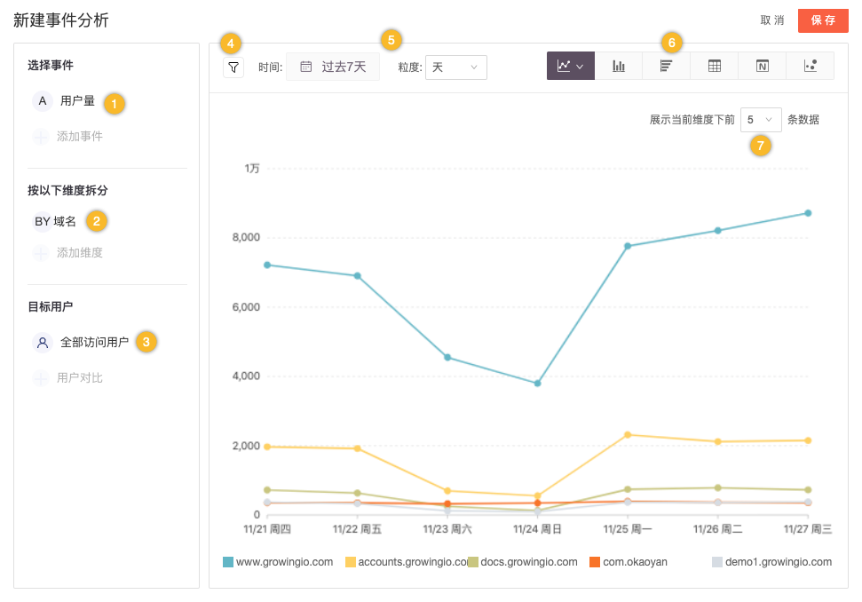

# 创建事件分析

## 操作步骤

一. 在顶部导航栏选择“**产品分析&gt;事件分析”**，进入单图列表的事件分析模块。

二. 单击**新建事件分析**，进入**新建事件分析**页面。

| 项 | 说明 |
| :--- | :--- |

| 1-添加事件 | 选择无埋点事件、埋点事件、合并事件、计算指标等任一事件或预定义指标进行分析。 |
| :--- | :--- |

<table>
  <thead>
    <tr>
      <th style="text-align:left">2-&#x6DFB;&#x52A0;&#x7EF4;&#x5EA6;</th>
      <th style="text-align:left">
        
&#x9009;&#x62E9;&#x7EF4;&#x5EA6;&#x62C6;&#x5206;&#x4E8B;&#x4EF6;&#x6307;&#x6807;&#xFF0C;&#x8FDB;&#x884C;&#x66F4;&#x52A0;&#x7CBE;&#x7EC6;&#x5316;&#x7684;&#x5206;&#x6790;&#xFF1B;&#x53EF;&#x9009;&#x7684;&#x62C6;&#x5206;&#x7EF4;&#x5EA6;&#x4F1A;&#x968F;&#x7740;&#x4E8B;&#x4EF6;&#x6307;&#x6807;&#x7684;&#x9009;&#x62E9;&#x800C;&#x4EA7;&#x751F;&#x53D8;&#x5316;&#x3002;&#x6700;&#x5927;&#x652F;&#x6301;10&#x4E2A;&#x7EF4;&#x5EA6;&#x503C;&#x7684;&#x62C6;&#x5206;&#x3002;

        
&#x5982;&#x679C;&#x60A8;&#x9009;&#x62E9;&#x7684;&#x4E8B;&#x4EF6;&#x6307;&#x6807;&#x4E0E;&#x7EF4;&#x5EA6;&#x7684;&#x7EC4;&#x5408;&#x65E0;&#x610F;&#x4E49;&#xFF0C;&#x7CFB;&#x7EDF;&#x4E5F;&#x4F1A;&#x8FDB;&#x884C;&#x63D0;&#x793A;&#x3002;

      </th>
    </tr>
  </thead>
  <tbody></tbody>
</table>

<table>
  <thead>
    <tr>
      <th style="text-align:left">3-&#x76EE;&#x6807;&#x7528;&#x6237;</th>
      <th style="text-align:left">
        
&#x9009;&#x62E9;&#x800C;&#x5206;&#x6790;&#x7684;&#x5BF9;&#x8C61;&#x4EBA;&#x7FA4;&#xFF0C;&#x652F;&#x6301;&#x6700;&#x591A;&#x9009;&#x62E9;
          10 &#x4E2A;&#x4E0D;&#x540C;&#x7C7B;&#x578B;&#x7684;&#x5206;&#x7FA4;&#x8FDB;&#x884C;&#x5BF9;&#x6BD4;&#x5206;&#x6790;&#x3002;

        
&#x6211;&#x4EEC;&#x9ED8;&#x8BA4;&#x63D0;&#x4F9B;4&#x79CD;&#x5206;&#x7FA4;&#x7528;&#x6237;&#xFF1A;&#x5168;&#x90E8;&#x8BBF;&#x95EE;&#x7528;&#x6237;&#x3001;&#x65B0;&#x8BBF;&#x95EE;&#x7528;&#x6237;&#x3001;&#x5168;&#x90E8;&#x767B;&#x5F55;&#x7528;&#x6237;&#x3001;&#x65B0;&#x767B;&#x5F55;&#x7528;&#x6237;&#x3002;

        
&#x4E5F;&#x53EF;&#x4EE5;&#x901A;&#x8FC7;&#x7528;&#x6237;&#x5206;&#x7FA4;&#x529F;&#x80FD;&#x521B;&#x5EFA;&#x7279;&#x5B9A;&#x7684;&#x5206;&#x7FA4;&#x7528;&#x6237;&#xFF0C;&#x5BF9;&#x7279;&#x5B9A;&#x7684;&#x5206;&#x7FA4;&#x7528;&#x6237;&#x8FDB;&#x884C;&#x5206;&#x6790;&#x3002;

      </th>
    </tr>
  </thead>
  <tbody></tbody>
</table>

| 4-全局过滤 | 过滤条件可选择不同维度的特定数值或文本，从而实现模糊或精确匹配，最多可叠加5种不同过滤条件。 |
| :--- | :--- |

| 5-时间范围与粒度 | 包括今日、昨天、过去7天、14天、30天、180天以及365天等常用用户活动周期。颗粒度选择可选小时、天、周以及月，确保分析精细程度。 |
| :--- | :--- |

| 6-图表类型 | 事件分析提供了6种不同的图表样式，依次是：1.线图 2. 纵向柱图 3.表格 4.横向柱图 5.数值 6.气泡图。详细请参考 [视图介绍](view.md)。 |
| :--- | :--- |

| 7-维度展示条数 | 设置图表中展示的维度条数。 |
| :--- | :--- |

四. 单击右上角保存，设置是事件分析图表名称及权限后，单击保存。

