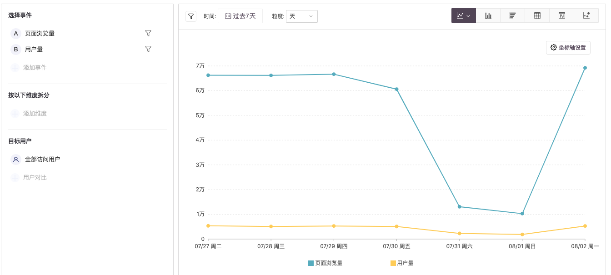
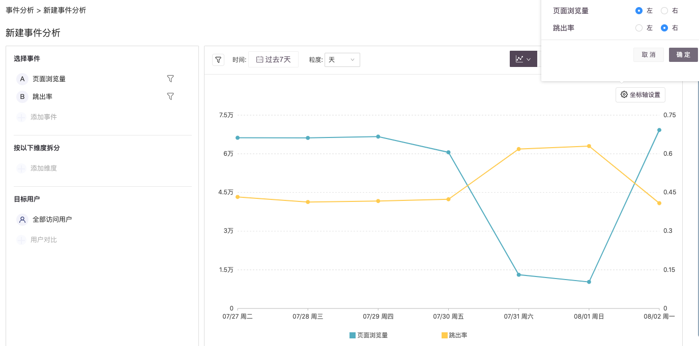

# 视图介绍



可以用于观察一个或多个数据指标连续变化的趋势，也可以根据需要与之前周期进行同比数据分析。线图的横轴是系统默认的时间，纵轴是指标。点击选择具体指标，该指标的数据会依次添加到右侧的线图中。

您可以选择一个或多个指标，这些指标都会在同一个坐标轴中呈现。当您选择多个指标，存在量级差，导致某个指标趋势无法观察。您可以在右上角使用【坐标轴设置】。 

当您选择显示今天、昨天、以及最近7天之内的数据时，我们可以提供小时粒度的数据\(周期对比曲线图除外\)； 如果选择最近7天之外的日期时，无法展示小时颗粒度的数据，具体的颗粒度根据您选择的时间范围可调整为：天/周/月，便于您根据场景追踪具体指标随时间的变化。

**为什么会出现虚线？**

可能会有两种情况，一种是代表不完整周期，比如周期是月，但是这个月还没有满 30 天，这时给出的本月数据是虚线；另一种情况是当前时间粒度下没有数据。



纵向柱图主要用于分析和对比各类别之间的数值大小 ，其中横轴表示需要对比的分类维度，纵轴表示相应的指标数值。您可以通过纵向柱图分析一个或多个指标在特定维度的分类表现。例如，产品经理和运营人员可以使用纵向柱图分析过去一段时间内不同访问来源过来的流量表现。

上图展示的是用户量、访问量、页面浏览量等流量指标从不同一级访问来源过来的数据表现。您可以通过纵向柱图对比不同访问来源过来的数据，进而判断哪些是高质量的渠道。



横向柱图是一种频数图，主要用于观察某个指标在某个维度上的分布。根据业务需求对指标按照一定维度拆分，对比不同组别的频数，便于分清轻重缓急， 您可以选择指标以及维度，进行时间范围调整和维度过滤。

上图展示的是页面浏览量在不同浏览器下的分布。可以发现，横向柱图清晰展示了用户在不同类别上的频数，并且按照数量从大到小进行排序。在资源有限的情况下产品可以先适配 Chrome 浏览器以提升绝大部分用户的体验。 常用来细分的维度，如浏览器，操作系统，城市，App 版本，设备型号，广告来源等。 应用：您做了渠道推广后，希望查看不同访问来源的访问用户量，可以选择指标为“用户量”，维度选择为“访问来源”。

可以看到上图显示的是：在过去 7 天内访问用户数总量前 10 名的访问来源按照降序显示出来，您可以判断哪些是高质量的渠道。



## **表格** 

表格是信息最密集的呈现方式，可以同时分析多指标和多维度的数据，您可以选择指标和维度，然后设置时间范围和展示粒度，可以进行维度过滤。

相较图表的形式，表格不那么容易看出变化趋势, 但是能更快地得到具体数值。对于核心 KPI 或您关心的指标，快速进行多维度拆解，灵活性高。图表中最多展示 100 条信息，表格进行多维度拆解时往往无法完整展示所有数据，您也可以下载表格以观测完整数据。注：下载受到权限控制。

在对多个目标用户群进行多事件指标、多维度分析时，表格将对事件指标进行拆分排序，并将各事件指标聚合在对应目标用户群下。

如未勾选时间维度，则按第一个目标用户群的第一个指标进行排序：

如勾选时间维度，则默认按时间维度进行排序：




## **数值图** 

数值表显示数据的方式最直观，当您想把您的核心指标通过最直观的形式展现时，建议使用数值表形式。选择具体的指标，对时间和维度进行选择，然后填写图表名称，保存即可。

上图的的意思是：在过去 7 天内，页面浏览量的总量为 4055，较上周期上升 10.4% 。



气泡图主要是分析多个事件在一个维度上之间的关系，比如油耗，速度，价格和不同的车型之间的关系。您可以分别设置 X 轴、Y 轴的具体事件，选中具体维度，再设置大小、颜色表示的事件，对时间和维度进行筛选，然后填写图表名称，保存即可。




环图主要用于展示分类对整体的占比情况。比如您可选择用户量作为指标，应用平台作为维度，了解各个平台对总用户量的占比。




