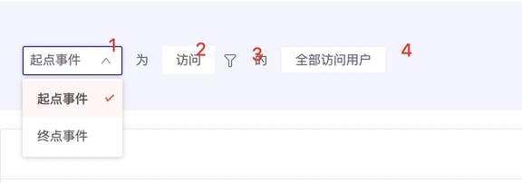

# 事件流分析

事件流帮您了解用户在您的 APP，Web 或小程序的用户旅程：

借助事件流您可以了解用户在任意一点之后的流向，也可以了解转化的用户是如何一步步完成转化的。您可能想知道用户进入产品后**去向分布**，去向否符合预设路径。想知道认领了优惠券的用户，接下来做了什么，亦或是购买的用户之前几步都做了什么。类似上述问题，事件流可以给您答案。

事件流是分析工具的组成部分，您可以在「 产品分析」-》「分析工具列表」打开事件流。


目前支持分析及统计的事件范围：埋点事件


#### 创建事件流

您可以在创建事件流时选择起始事件或者终点事件：

起始事件查看流向：起始事件帮您了解用户做了一个行为之后，接下来做了什么。比如打开产品的用户接下来做了什么。

终点事件查看来源：终点事件帮您了解用户是如何实现转化目标的。您可以了解购买成功的用户购买之前做了什么。

创建事件流的操作解释：

1 代表选择起始事件或者终点事件类型：

2 可以选择任意一个埋点事件。默认展示起始事件是「访问」：即打开产品。

3 可以选择事件的过滤条件，如任意的事件级变量：优惠券名称；访问变量：如访问来源等。

4 可以选择任意用户分群：默认展示访问用户，您可以选择任意用户分群进行查看，以便于您了解特定用户群的用户旅程。

基于上述条件您可以查看：

起点事件是任意事件的任意用户分群的用户流向，或者终点事件是任意事件的任意用户分群的用户来源。

比如过去7天短信召回用户打开产品后的行为分布事件流。过去七天的首单用户的转化来源分布事件流。

对事件流的「时间范围」和「窗口」的解释：

您可以查看今天和过去30 天之内任意时间段的事件流。

您可以选择窗口在 15 分钟 ~ 1 天时间的窗口。如果您的窗口选择 15分钟 意味着，从起始事件开始 15 分钟内用户的流向，15 分钟后的行为即为流失。

特别指出天是自然天的意思。举个例子：如果一个用户在晚上 11：30 做了事件A，第二天凌晨00：01 做了事件B，窗口设置是 1 小时，我们会认为事件A之后用户流失。

####  

#### 事件流图表区域的操作：

事件流由节点和纽带组成。节点是事件次数的和，在事件流上展示的是节点高度。纽带链接节点，代表节点和节点之间的转化效率。如下图

1 通过点击节点右上角「展开节点」来看到节点的去向。展开的节点都可以点击收起节点。

2 对每一步中，默认展示 Top 5节点。如果您想看更多节点，点击「更多」展开，则会呈现出 Top10 的节点流向，更多可以一直点击直到节点不可在拆解。

#### 高亮效果

您可以点击节点或者纽带来**高亮**节点和对应纽带，这样您就能聚焦在您所关注的节点和用户路径上：

可以通过再次点击节点或者纽带，来取消高亮。

高亮纽带：

高亮节点：

####  

#### 事件流数据的解读：

您可以通过 Hover（鼠标悬停） 看到节点相关的数据描述，这样您就能量化地理解用户真实的路径，以及用来判断实际用户的路径是否符合产品预设。

对于起始事件流：

我们提供了每个节点的次数和相对于起始事件的比率，其可以帮您了解这个节点和起始节点的转化效率。同时如果节点有流失，则会呈现退出的次数和退出人数。退出的定义：到达某个节点之后再未触发任何事件视为退出。

节点的转化率统计定义：

人数转化率：对应节点的UV 除以 起始节点的 UV。

次数转化率：对应节点的事件总数除以起始节点的事件总数。

退出统计定义：

退出率人数定义 ： 窗口期内 从未转化的UV  除以 流经这个节点的UV注意：过转化但是也有过离开的人，不算在离开的人里面

退出率次数定义：窗口期内 退出次数除以节点次数。

对于终止事件：

操作和起始事件相同，当用户在 Hover 时，我们会提供终止事件的上级节点 TOP 5 分布分布以及占比情况，帮助您直接查看到每个节点商机转化来源的分布。

\*\*注意：事件流已经于2020年4月在企业版中上线，若您所在的项目中未看到此功能，可联系对应客户成功经理申请试用。

