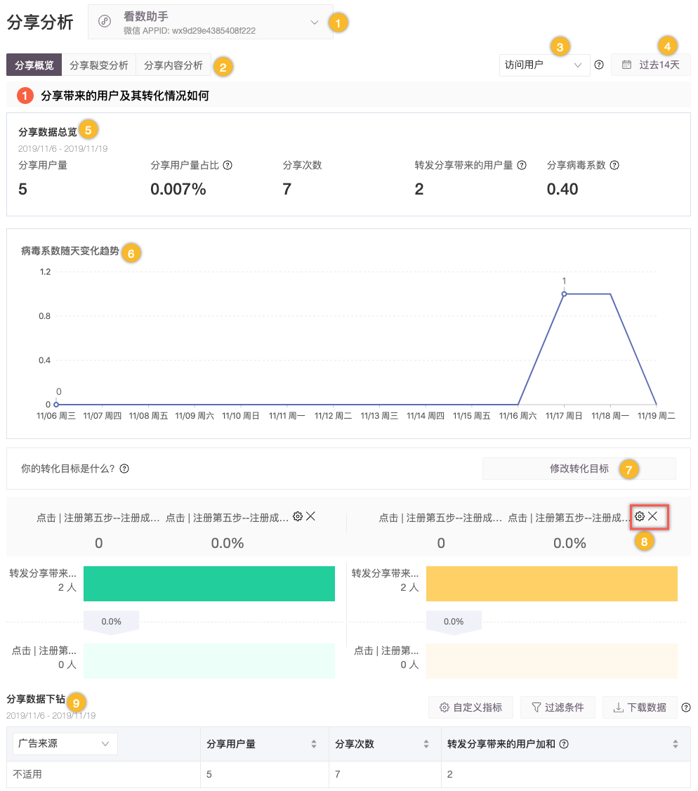
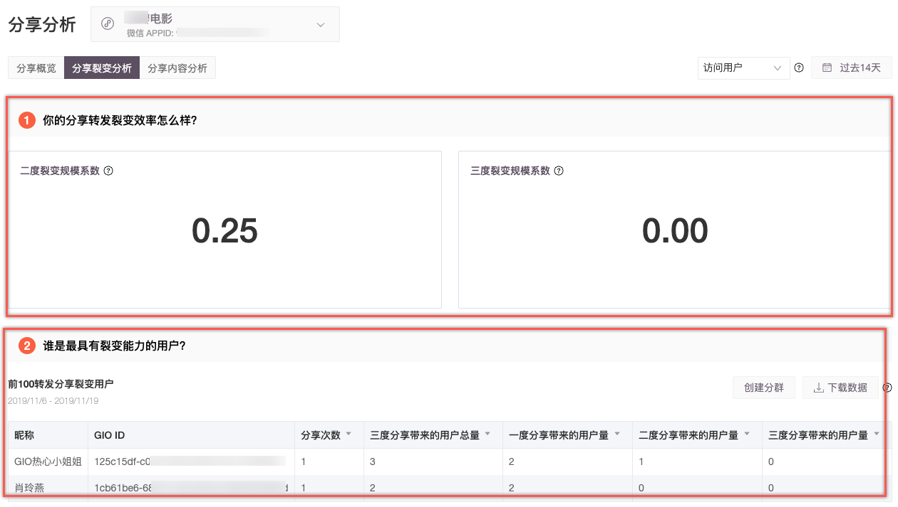
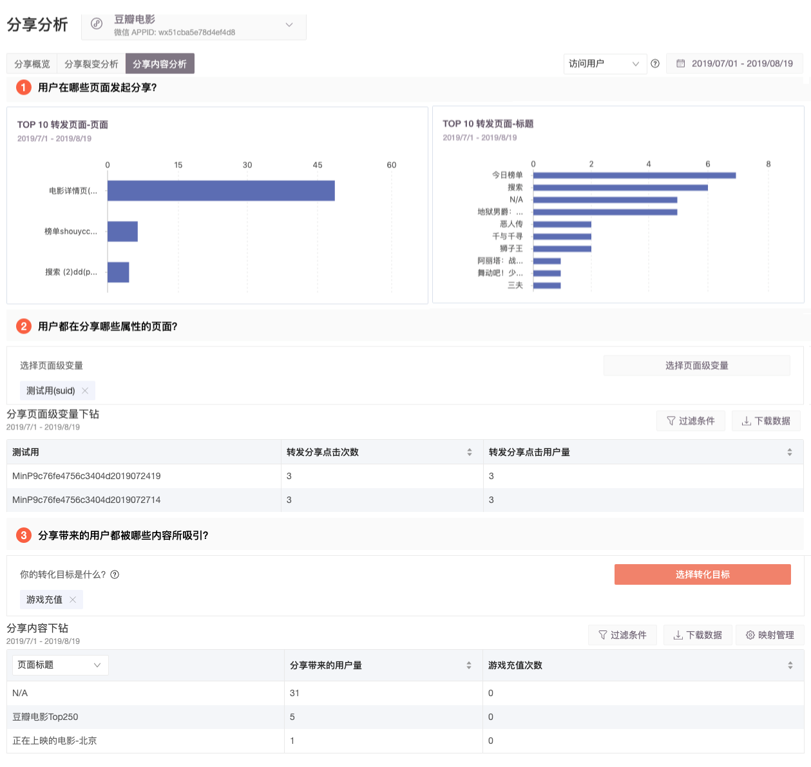
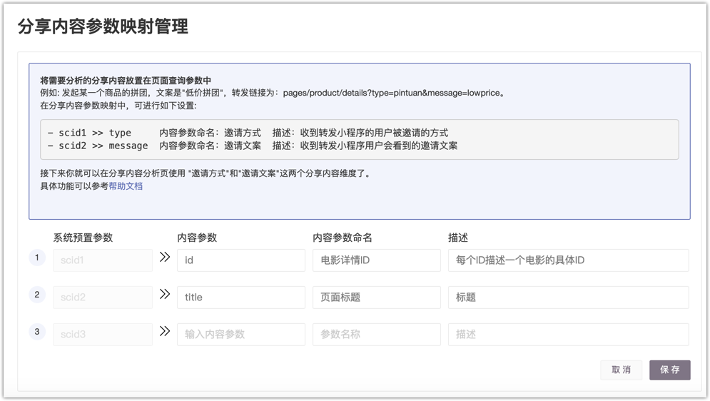

# 分享分析

## 什么是分享分析

小程序处在微信生态下，分享功能是小程序拉新、获客的重要途径。GrowingIO推出了分享分析，帮助您一目了然看到您小程序的分享获客、拉新、转化等数据，并进一步挖掘分享的KOL。

## 前提条件 

GrowingIO会默认帮您统计转发事件（分享用户量和分享次数）。如果想统计到”转发分享带来的用户“，则需要在集成小程序SDK时开启分析分享功能。 详细请参考”微信小程序SDK > [SDK参数配置](../../../developer-manual/sdkintegrated/mini-program-sdk/3.7-ji-yi-xia/ji-cheng/minp-sdk.md#sdk-can-shu-pei-zhi)“。

## 使用分享分析 

一. 在顶部导航栏选择“**获客分析 > 分享分析”**，进入分享分析页面。

二. 选择待分析的小程序应用、用户群、时间范围，查看分析数据。

分析数据分为以下三部分：

### ​分享概览

| 模块 | 说明 |
| -- | -- |

| 1-选择应用 | 在集成多个小程序应用时，用来切换小程序。 |
| ------ | -------------------- |

| 2-选择分析内容 | 选择分析概览。 |
| -------- | ------- |

| 3-选择用户群 | <ul><li>访问用户：即”转发分享带来的用户量“，统计的是由分享带来的全部访问用户量，”转化目标“统计的是由分享带来的<strong>全部访问用户</strong>中转化的用户量，KOL分享带来的三度用户量，也在”全部访问用户“基础上计算。</li><li>新访问用户：即“转发分享带来的用户量”，统计的是由分享带来的新访问用户量，“转化目标”统计的是由分享带来的<strong>新访问用户</strong>中转化的用户量，KOL 分享带来的三度用户量，也在“新访问用户”基础上计算。</li></ul> |
| ------- | -------------------------------------------------------------------------------------------------------------------------------------------------------------------------------------------------------------------------------------------------------------- |

| 4-选择时间 | 选择分析的时间范围，预置常用的事件范围（昨天、过去7天、过去14天、过去30天）。 |
| ------ | ----------------------------------------- |

| 5-分项数据总览 | 展示分享产生的用户数、次数，一级由转发分享带来的整体获客和拉新的用户量。 |
| -------- | ------------------------------------ |

| 6-病毒系数变化趋势 | 计算整体的病毒系数，并且按天展示病毒系数的变化。 |
| ---------- | ------------------------ |

| 7-设置转化目标 | 选择您关注的行为作为转化目标，了解分享带来的用户量中，转化的用户有多少，并可以直观的查看转化率、转化金额、转化的平均金额等 |
| -------- | ------------------------------------------------------------- |

| 8-转化目标的衡量指标选择 | 
单击 ，选择转化目标的衡量指标。
<ul><li>用户量</li><li>转化率</li><li>次数</li></ul> |
| ------------- | ----------------------------------------------------------------------------------------------------------------------------- |

| 9-分享数据下钻 | <ul><li>
允许进一步对触发分享事件的用户进行部分维度否拆分计算。
<ul><li><strong>广告类维度</strong>（广告来源、广告名称、广告内容、广告关键字、广告媒介）：统计每个广告渠道获取的用户中，触发分享的用户数，次数，以及由转发分享带来的整体获客和拉新的用户量，以及其中转化的用户量。从而<strong>深入判断获客渠道的用户转发分享的获客和转化效率</strong></li><li><strong>用户变量类维度</strong>（性别、城市、省、国家）：统计不同的用户属性下，触发分享的用户数，次数，以及由转发分享带来的整体获客和拉新的用户量，以及其中转化的用户量。从而<strong>深入判断不同类型的用户转发分享的获客和转化效率</strong>。</li></ul></li><li>选择自定义指标，查看转化目标相关的更多指标。</li><li>纬度值过滤，可以配置维度拆分计算，支持进行多维度交互的深入分析。</li></ul> |
| -------- | ------------------------------------------------------------------------------------------------------------------------------------------------------------------------------------------------------------------------------------------------------------------------------------------------------------------------------------------------------------------------------------------------------------------------------------------------------- |

对分享来说，我们最关键的，除了知道分享的ROI，针对用户颗粒度下降，需要知道谁是产品中最能带来用户的“超级用户”。

通常情况下，我们一般评估一个用户直接带来的用户量有多少，但是在微信体系下，就忽略了用户可能隐藏存在的巨大的社交关系。GrowingIO分享用户分析，帮助您定位直接一度分享和三度分享下的“分享超级用户”。

#### 具体解释： 

三度分享计算举例：用户A 分享带来了用户B， 用户B 的分享带来了用户C，用户C带来了用户D

三度分享计算及结果如下： 用户A带来的三度分享用户总量是 3 （即用户B、用户C和用户D），其中一度、二度、三度分别是 1，1，1； 用户B带来的三度分享用户总量是2，其中一度、二度、三度分别是：1，1，0； 用户C带来的三度分享用户总量是1，其中一度，二度，三度分别是：1，0，0。

如果一个用户带来的总用户量多，且一度用户很多，说明这个用户有很大的直接社交圈，即一般意义上的KOL（用户的社交关系存量是较大的）。

如果一个用户带来的总用户量多，但是一度用户不多，而二度用户较多，说明这个用户和有较大直接社交圈的人有联系，即一般意义上是KOL的影响人（社交关系中认识社交关系存量较大的用户）。

| 模块 | 说明 |
| -- | -- |

| 1-二三度裂变规模系数 | <ul><li>二度裂变规模系数用来指示分享获客中，二度到一度的平均裂变规模（二度裂变规模系数=二度转发带来的用户加和 / 一度转发带来的用户加和）</li><li>三度裂变规模系数用来指示分享获客中，三度到一度的平均裂变规模（三度裂变规模系数=三度转发带来的用户加和 / 一度转发带来的用户加和）</li></ul> |
| ----------- | --------------------------------------------------------------------------------------------------------------------------------------------------------------- |

| 2-转发分享裂变Top100用户 | 
最有裂变能力的前100位用户。
<ul><li>创建分群：将当前具有裂变能力的用户进行分群。</li><li>下载数据：下载当前表格展示的数据。</li></ul>

 |
| ---------------- | ----------------------------------------------------------------------------------------------- |
|                  |                                                                                                 |

| **模块**          | 说明                                                                     |
| --------------- | ---------------------------------------------------------------------- |
| 1-发起分享最多的页面     | 了解用户在哪些页面发起分享。                                                         |
| 2-被分享最多的页面的属性   | 了解用户在具有哪些属性的页面发起分享。                                                    |
| 3-用户通过哪些分享进入小程序 | [配置内容参数](shareanalysis.md#pei-zhi-ye-mian-can-shu)，分享所带来的用户被哪些内容吸引、转化。 |

### 配置内容参数

内容参数即您分享页面URL中的查询参数，您可以将查询参数设置为分享页面的页面变量，在分析时使用此变量对统计值进行拆分。

一. 在分享内容分析页面最下方单击”**配置内容参数**“，如已配置，则单击**映射管理**，进入**分享内容参数映射管理**页面。


GrowingIO已预置3个内容参数，您需使用映射功能关联您的内容参数。


二. 配置内容参数，并单击保存。

以`pages/product/details?type=pintuan&message=lowprice。`为例，您可以将type 、message设置为内容参数。

## 指标解释

* 分享用户数：触发转发分享事件的访问用户数量；
* 分享次数：转发分享事件被触发的次数；
* 转发分享带来的用户数：通过点击其他用户分享到 好友聊天/群聊天 中的小程序，进入小程序的用户量；
* 选择相应的转化目标：通过点击其他用户分享到 好友聊天/群聊天 中的小程序进入小程序的用户中，在选择的时间周期中，完成相应转化目标事件的用户数;
