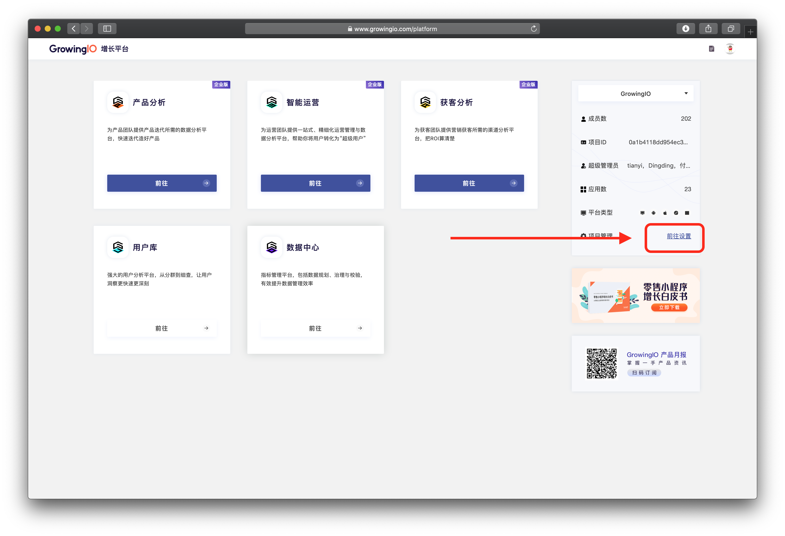

# 项目管理

## 什么是项目？ 

#### 从数据管理的角度看

GrowingIO 的项目是用来隔离数据的。项目间的数据是相互隔离的，不支持跨项目的数据分析与数据整合。


场景Ａ

企业内有不同的产品线 ，产品线之前相互独立运营，彼此之间没有数据整合与交叉分析的需求。如：游戏类型app  \ 社交产品app\  内容产品 web ，三者互相独立经营，我们可以分别建立三个项目。



场景Ｂ

同一条产品线多个端 。如：同一个产品线有官网web、小程序端、ios 端、android 端 ，面对的用户是同一群体，经营者为同一团队 ，我们可以放在同个项目中。 


#### 从人员管理的角度看

GrowingIO 的项目是用来建立组织间协作关系的。在Ａ项目的成员，是无法看到Ｂ项目的数据 ， 即便两个项目在同一个组织下。

当我们有两个团队相互独立时，我们可以考虑建立两个项目。

若两个团队有交叉协同的需求，如团队1 所做的看板 ，需要让团队2 的人看见，此时我们可以在同个项目中，通过看板的协作与其他团队分享。


场景Ａ： 

1.市场团队、产品团队为两个团队

产品经理建立的活跃度看板需要让市场总监查看， 渠道投放人员的渠道监测看板需要分享给产品经理 ，那我们应该将两个团队人员加入同个项目。



**项目间数据的关系**：

一个项目下的多个应用数据会被合并统计，并在概览中通过平台、AppID 的方式区分。

在其他分析模块中，您可以通过“域名”（对应移动端的包名和小程序的 AppID）或“网站/手机应用“维度拆分、过滤不同应用数据。


## 如何进入项目管理？

1. 在用戶切換匡上 ，点击项目管理。

2. 在平台页中 ，点击前往设置。

