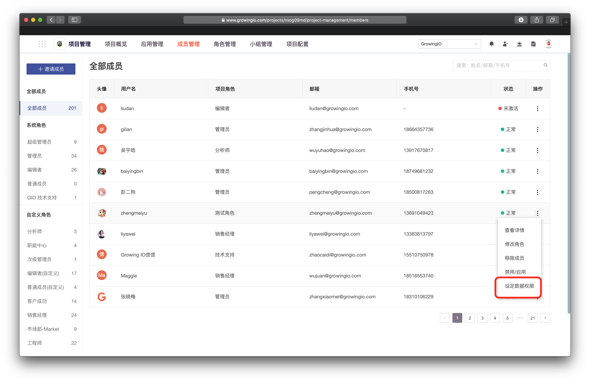
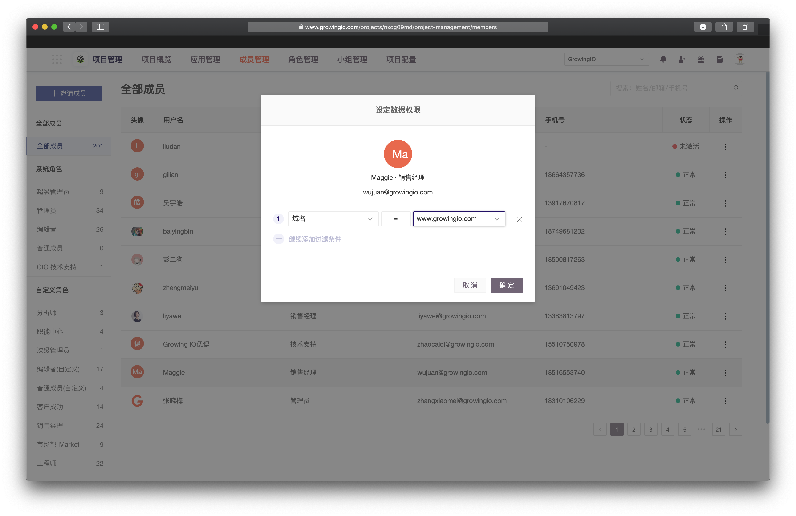

# 数据权限-done

## **概述**

数据权限指可以对**每一个項目成员**设置多个数据访问限制条件，并在项目中生效，所有访问数据的节点都会被控制。该功能可以有效的控制数据的可见范围，实现同一张图表不同的用户看到不同的数据。

## **用途**

当组织内部为了数据安全与企业组织分工，需要部分数据不让某成员查看时 ，我们可以通过数据权限，设置数据可见范围，从而保证数据安全性。


**数据权限使用场景**

假设您希望**北京的区域经理，**只可以看到北京地区的数据，上海的区域经理只可以看到上海的数据。

则可以设置北京的区域经理的数据权限为  ”城市=北京“，上海的区域经理的数据权限为”城市=上海“。

此时同一张图表对于两个区域经理将显示不同的数据。 



**注意事项**

数据权限对用户分群无效。因为用户分群计算量庞大，GrowingIO 每天晚上对用户分群数据进行离线计算，因此无法对每一个设置数据权限的用户单独计算一份分群数据。


## **设置数据权限（企业版功能）**

有成员管理权限的用户进入用户管理页面。

1. 点击操作--设定数据权限。 

2. 用户信息修改对话框，调整该成员数据查看范围。

## **支持设置的维度包括**：

1. **系统默认维度**：访问来源、一级访问来源、浏览器、操作系统、城市、地区、国家代码、国家名称、域名、网站/手机应用、设备类型、广告来源等。
2. **自定义维度**：全部。

## **支持的条件组合包括**：

1. =：等于；
2. ≠：不等于；
3. in：在给定的值之中；
4. not in：在给定值之外。

